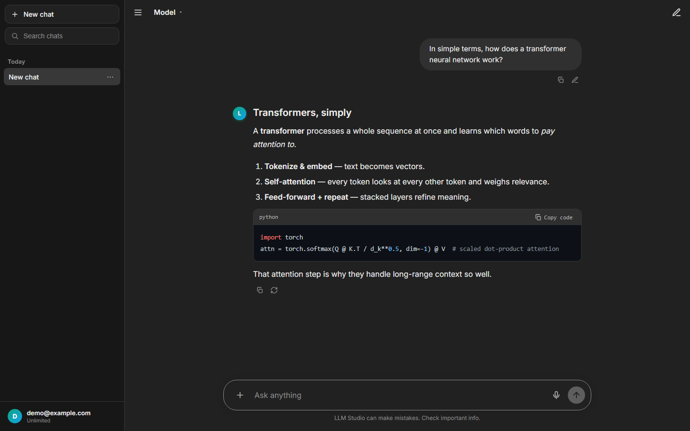
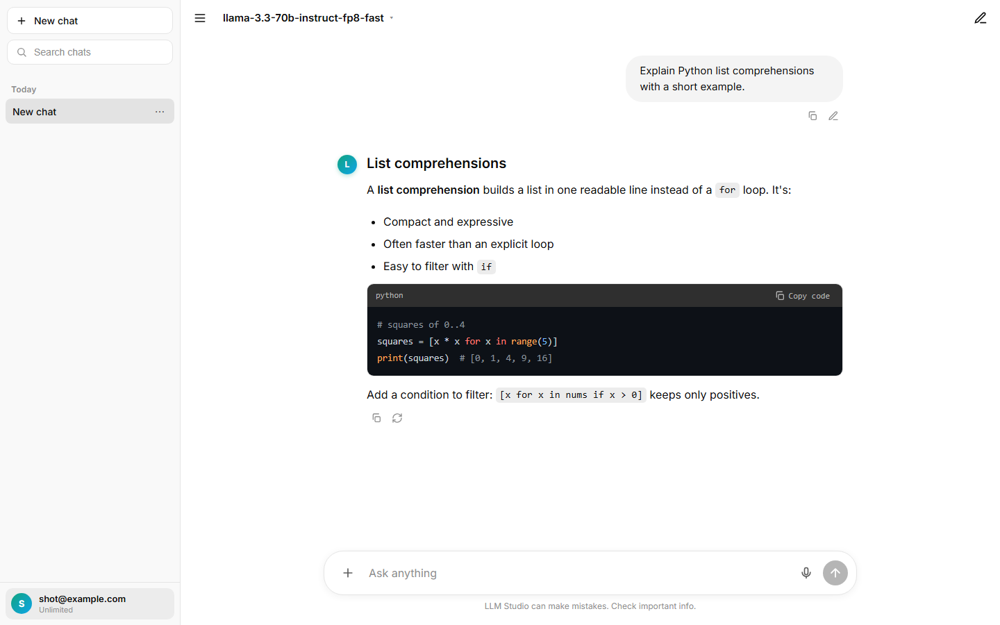
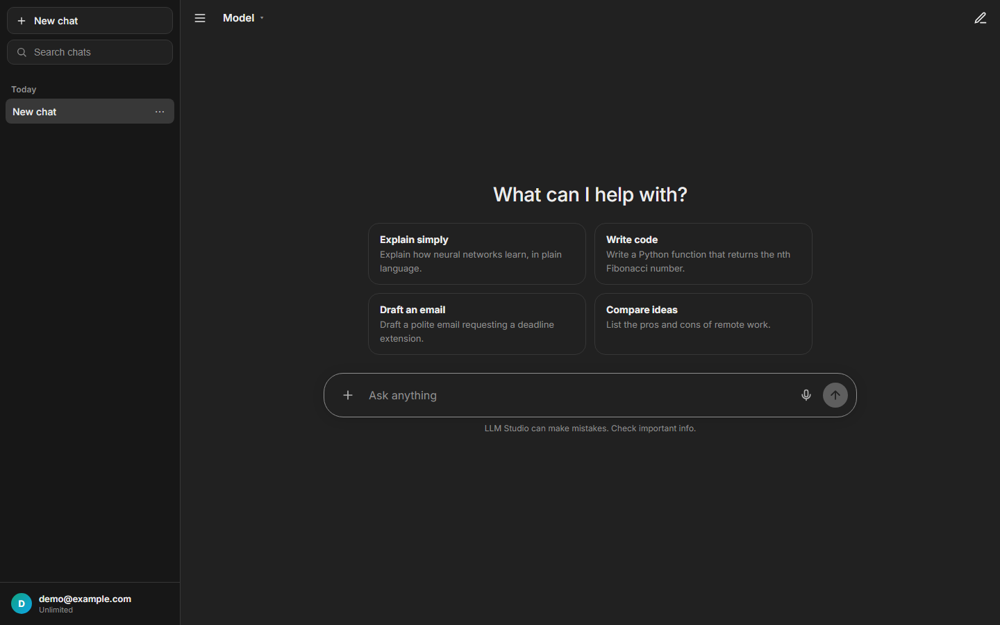
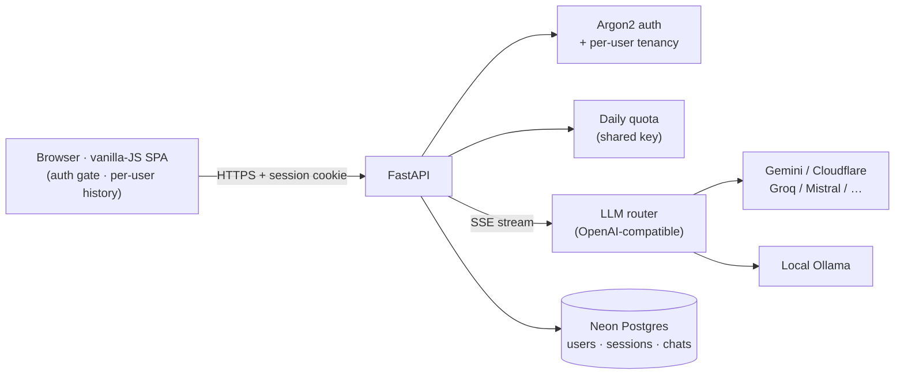

<div align="center">

# 🤖 LLM Studio

### A multi-user, ChatGPT-style AI chat SaaS — built and deployed end-to-end.

Sign in, chat with **cloud or local** LLMs, and your conversations follow you across devices.
One shared model key powers everyone, with a fair per-user daily quota.

[](https://heisenbergblue-llm-studio.hf.space)
&nbsp;
[](https://github.com/mubin-attar-007/llm_studio/actions)


<br/>



</div>

---

## ✨ Why it's interesting

This isn't a toy clone — it's a **production-shaped SaaS**: real accounts, per-user data isolation,
a shared-key quota model, security hardening, CI/CD, and a **live deployment** on Hugging Face +
Neon Postgres. The frontend is dependency-free vanilla JS tuned to **pixel-match ChatGPT** (monochrome
actions, flat surfaces, prose rhythm), and the backend is a clean, layered FastAPI service.

## 🎯 Features

- 🔐 **Accounts & sessions** — email + password (**Argon2id**), HttpOnly session cookies. Chats are
  private to your account and stored **server-side**, so they sync across browsers and devices.
- 💬 **Streaming chat** — token-by-token **SSE**, Markdown + syntax highlighting + KaTeX math, edit &
  regenerate, copy, auto-titles, searchable date-grouped history, export.
- 🧠 **Many models, one app** — OpenAI-compatible routing to **Gemini, Cloudflare Workers AI, Groq,
  Mistral, Z.ai/GLM, NVIDIA**, or a **local Ollama** — each tagged, reasoning models flagged.
- 🆚 **Compare mode** — run one prompt against 2–3 models side-by-side.
- 📎 **Document context** — attach `.txt / .md / .pdf / .docx` (size + MIME limited) to ground a reply.
- 📊 **Per-user daily quota** — the server holds a shared key; each user gets a daily budget
  (first account registered = admin, unlimited).
- 🎨 Light/dark/system theme, voice input, keyboard shortcuts, friendly error cards.

<div align="center">


</div>

## 🏗️ Architecture

A layered FastAPI backend serving a dependency-free vanilla-JS frontend, deployed as a single container.



```
app/
  main.py          FastAPI entry: routers, security headers + CSP, request logging, /healthz
  api/             routes (chat/history) · auth_routes (register/login/logout/me)
                   dependencies (auth + rate limit) · streaming (SSE)
  services/        chat_service · history_service · document_service · quota_service
  llm/             client (provider routing) · providers/ · prompts/
  database/        engine (Postgres⇄SQLite) · models · repository
  core/            config · security (Argon2 + tokens) · ratelimit · logging
  templates/ static/  index.html · styles.css · app.js
```

- **Auth/tenancy:** DB-backed sessions; every `/api/*` route requires auth; chats are strictly scoped
  to their owner (no cross-tenant reads or overwrites).
- **Data:** **Neon Postgres** in production, SQLite locally & in tests. (Epoch columns are `BigInteger` —
  a real bug caught in prod: `INT4` overflows at ~2.1e9. 🐛)
- **Hardening:** in-memory rate limiting, upload size/MIME limits, Content-Security-Policy, HSTS,
  DSN-gated Sentry, structured request logging.

## 🚀 Run locally

```bash
uv venv --python 3.12 && uv pip install -r requirements.txt
cp .env.example .env          # add a provider key (Gemini / Groq / Cloudflare … or Ollama)
.venv/Scripts/python -m app.main      # → http://127.0.0.1:5000
```

No `DATABASE_URL` → local SQLite. **Tests & lint:** `pytest -q` · `ruff check .` (both gate CI).

## ☁️ Deploy

Containerized (`Dockerfile`) → any Docker host. The live demo runs on a **Hugging Face Docker Space**
+ **Neon Postgres**, via a one-command deploy script — see [docs/DEPLOYMENT.md](docs/DEPLOYMENT.md).

## 🛠️ Tech stack

**Backend:** FastAPI · SQLAlchemy 2.0 · Pydantic · Argon2 · psycopg · Uvicorn
**Frontend:** vanilla JS (SSE, no framework) · marked · DOMPurify · highlight.js · KaTeX
**Infra:** Docker · Neon Postgres · Hugging Face Spaces · GitHub Actions (ruff · pytest · pip-audit · gitleaks) · Dependabot

## 📄 License

Personal project by **[Mubin Attar](https://github.com/mubin-attar-007)** · AI/ML Engineer.
